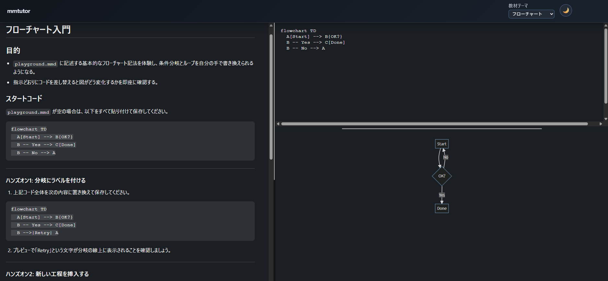

# mmtutor (MVP)

Mermaid を「手で覚える」ためのローカル教材 + ライブプレビュー環境です。ブラウザの 2 ペイン UI で教材を読みつつ、右上のエディタに Mermaid 記法を書き、即時プレビューで確認できます。

### スクリーンショット



## Quick Start

```bash
git clone https://github.com/hiroki-imai/mmtutor.git
cd mmtutor
npm install
npm run dev
```

`npm run dev` を実行するとローカルサーバが `http://127.0.0.1:5678` で立ち上がります。ブラウザが自動で開かない場合は URL を手動で開いてください。

### 画面の構成

- **左ペイン**: 教材テキスト（日本語）。各トピックの最小雛形・よく使う記法・演習問題を掲載。
- **右上**: Mermaid ソース入力欄（textarea）。編集すると 300ms デバウンスで `playground.mmd` が保存されます。
- **右下**: プレビュー。図をクリックまたは Enter/Space キーで拡大モーダルを開けます。
- **ヘッダー右上**:
  - 「教材テーマ」プルダウンで 12 種類のトピックを切替。
  - テーマ切替（ライト / ダーク）。
  - 保存ステータス表示。

### ローカルエディタと併用

実行時に `<プロジェクトルート>/.mmtutor/` が生成され、`playground.mmd` を任意のエディタで編集できます。保存すると chokidar が検知し、ブラウザの textarea とプレビューが即時更新されます。

## スクリプト一覧

```bash
npm run dev            # tsx で開発サーバを起動
npm run build          # TypeScript を dist/ にビルド
npm run prepare:vendor # web/vendor/ を最新化（mermaid/marked/DOMPurify/highlight.js）
```

- `npm install` 時にも `build` と `prepare:vendor` が実行され、ブラウザ側の依存 JS/CSS が配置されます。
- ビルド成果物は `dist/` に出力され、`node dist/cli.js` でサーバを起動することも可能です。

## ディレクトリ構成

```
├── lessons/        # 教材 Markdown（トピック別）
├── templates/      # 初期 Mermaid テンプレ
├── src/            # サーバ・監視ロジック（TypeScript）
├── web/            # フロントエンド（HTML/CSS/JS）
├── scripts/        # ビルド補助スクリプト
├── dist/           # ビルド成果物（npm run build）
└── .mmtutor/       # 実行時に生成される作業ファイル
```

## トラブルシュート

- **プレビューが表示されない**: Mermaid のパースエラー時は右上にエラーメッセージが表示されます。修正すると自動復旧します。
- **SSE が切断される**: ネットワーク要因で数秒後に自動再接続します。必要に応じて `npm run dev` を再起動してください。
- **ブラウザで保存しても更新されない**: `.mmtutor/playground.mmd` の書き込み権限を確認してください。
- **Windows で監視が動かない**: ウイルス対策やファイルロックで chokidar がブロックされていないか確認してください。

## 使用ライブラリ

- Mermaid 10.9.x
- marked
- DOMPurify
- highlight.js（esbuild でバンドル）

各ライブラリのライセンスを確認のうえご利用ください。
