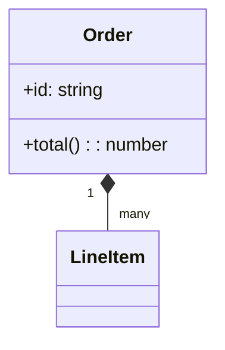
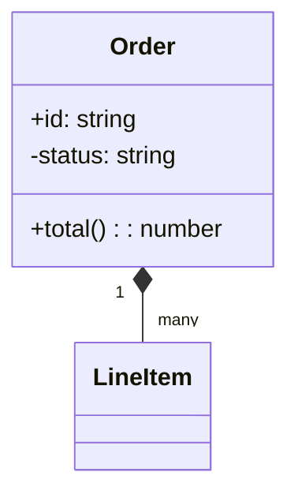
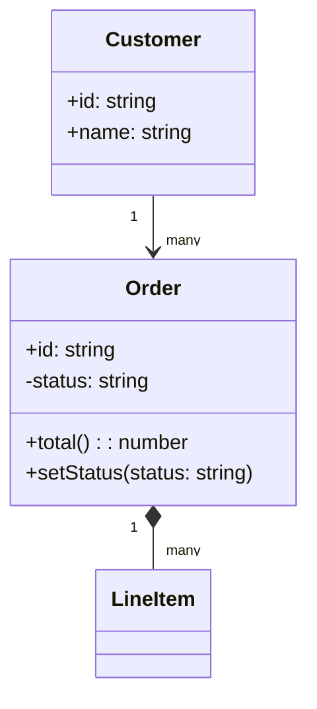
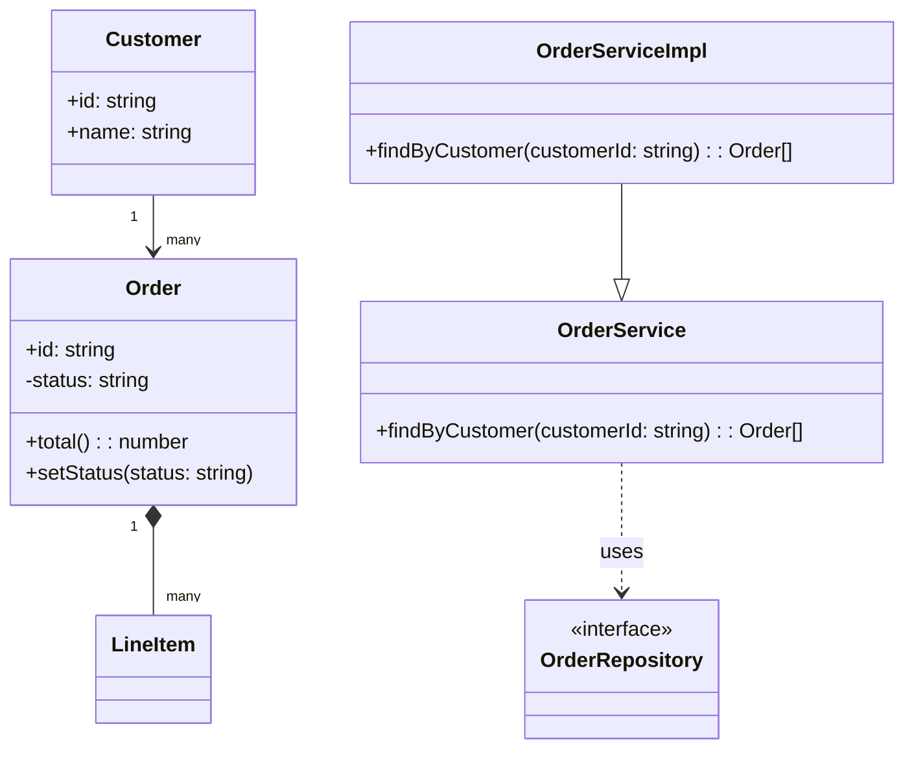

# クラス図入門

## 目的
- クラス図で属性・メソッド・関連を手入力しながら理解する。
- 指定された変更をそのまま `playground.mmd` に貼り付け、結果を確認する。

## スタートコード
`playground.mmd` が空の場合は以下を貼り付けて保存してください。

---

### ハンズオン1: 属性を追加する
1. 上記コードを次の内容に置き換えて、`Order` にプライベート属性 `-status: string` を追加します。

2. プレビューで `status` が Order クラス内部に表示されていることを確認しましょう。

---

### ハンズオン2: メソッドと関連を広げる
1. 次のコードに置き換えてください。`Customer` と `Order` の関連、そして `Order` に `+setStatus(status: string)` を追加します。

2. Customer → Order の関連線と新しいメソッドが表示されることを確認してください。

---

### ハンズオン3: 継承とインターフェースを追加する
1. 最後に以下のコードへ置き換え、サービス層のインターフェースと継承関係を追加します。

2. 継承（`--|>`）と依存（`..>`）の矢印が追加され、インターフェース表記 `<<interface>>` が表示されることを確認しましょう。

---

## 振り返り
- クラス内の属性は `+`（公開）、`-`（非公開）などで可視性を表現できる。
- クラス間の関連や継承は矢印で示し、文字列ラベルで多重度や役割を伝えられる。
- インターフェースは `<<interface>>` を付与するだけで視覚的に区別できる。
