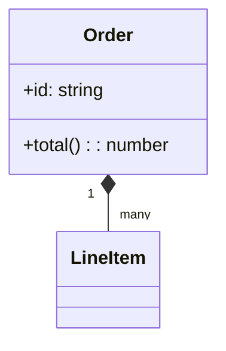

# Class Diagram（構造の俯瞰）
目的：クラスとその関係を最小限の記法でまとめ、ドメインの骨格を共有できるようになる。

## 最小雛形

## よく使う
- アクセス修飾子：`+` 公開、`-` 非公開、`#` protected
- 関連の多重度：`"1" -- "many"` のように表記
- 継承：`Child --|> Parent`
- インターフェース：`class Service <<interface>>`

## 演習
1. `Customer` クラスを追加し、`Customer "1" --> "many" Order` の関連を描こう。
2. `Order` に `-status: string` の属性を追加し、`status` をメソッド `setStatus(status)` で変更できるように記述せよ。

## 注意
- クラス名の重複は避ける。名前空間が必要な場合は接頭辞で区別する。
- 関連線が交差しすぎる場合は図を分割するか向きを変える。
