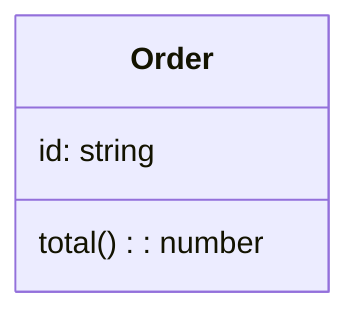

# クラス図入門

## スタートコード
右上のエディタが空の場合は、以下をすべて貼り付けて保存してください。



シンプルなクラス図です。`class` ブロック内に属性（データ）とメソッド（処理）を記述します。

**記法のポイント**:
- `classDiagram`: クラス図の宣言
- `class クラス名 { ... }`: クラスの定義
- 属性は `名前: 型`、メソッドは `名前(): 戻り値型`

---

### ハンズオン1: 可視性修飾子を追加する

2行目の `id: string` を `+id: string` に、3行目の `total(): number` を `+total(): number` に変更してください。

プレビューで `+` マークが表示されます。`+` は public（公開）、`-` は private（非公開）を意味します。

---

### ハンズオン2: プライベート属性を追加する

3行目の後に `-status: string` を追加してください。

プレビューで `status` が `-` マーク付きで表示されます。可視性修飾子でカプセル化を表現できます。

---

### ハンズオン3: クラス間の関連を追加する

最終行（`}` の後）に `Order "1" *-- "many" LineItem` を追加してください。

プレビューで `Order` から `LineItem` への線が表示されます。`*--` はコンポジション（強い所有関係）を表し、`"1"` と `"many"` は多重度です。

---

### ハンズオン4: 継承関係を追加する

最終行の後に以下を追加してください：
```mermaid
  class SpecialOrder {
    +discount: number
  }
  SpecialOrder --|> Order
```

プレビューで `SpecialOrder` が `Order` を継承する矢印が表示されます。`--|>` は継承（is-a関係）を表します。

---

## 振り返り
- `+` は public、`-` は private などの可視性を表現する
- `*--` はコンポジション、`-->` は関連、`--|>` は継承を表す
- `"1"` や `"many"` で多重度を指定できる
- クラス間の関係を矢印で視覚化できる
