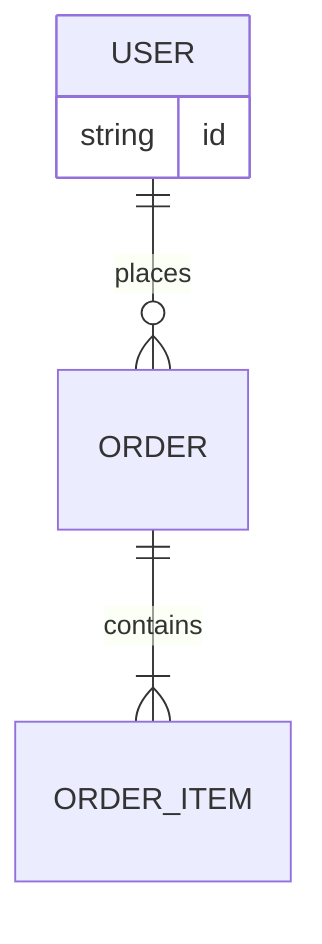
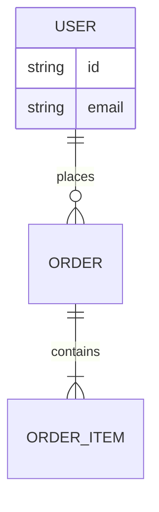
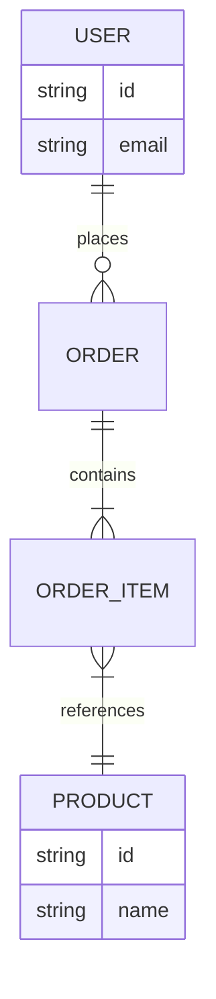

# ER 図入門

## 目的
- エンティティ、属性、多重度を手入力で体験し、データ構造の関係性を理解する。
- 指定されたコードをそのまま `playground.mmd` に貼り付け、図の変化を即座に確認する。

## スタートコード
以下を `playground.mmd` に貼り付けて保存してください。



---

### ハンズオン1: 属性を付け足す
1. 上記コードを次の内容に置き換え、`USER` に `email string` を追加します。



2. `USER` のボックスに `email` が表示されることを確認しましょう。

---

### ハンズオン2: PRODUCT エンティティを追加する
1. さらに以下のコードへ置き換えます。`PRODUCT` を追加し、`ORDER_ITEM` からの多対1を表現しています。



2. `PRODUCT` エンティティと `references` の線が表示されることを確認してください。

---

### ハンズオン3: 主キーと外部キーを明記する
1. 最後に次のコードへ置き換え、属性に `PK` / `FK` / `UNIQUE` を付与します。

```mermaid
erDiagram
  USER ||--o{ ORDER : places
  ORDER ||--|{ ORDER_ITEM : contains
  ORDER_ITEM }|--|| PRODUCT : references

  USER {
    string id PK
    string email UNIQUE
  }

  ORDER {
    string id PK
    string user_id FK
  }

  ORDER_ITEM {
    string id PK
    string order_id FK
    string product_id FK
  }

  PRODUCT {
    string id PK
    string name
  }
```

2. 属性名に役割が明示され、ER 図上でリレーション構造が読みやすくなったことを確認しましょう。

---

## 振り返り
- 多重度は `||`, `o{`, `|{` などの記号で表現する。
- エンティティの `{ }` 内にデータ型や役割を記載できる。
- 図はコードを差し替えるだけで更新されるので、ステップごとの変化を確認しよう。
