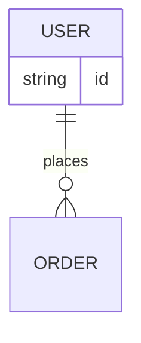

# ER図入門

## スタートコード
右上のエディタが空の場合は、以下をすべて貼り付けて保存してください。



シンプルなER図です。エンティティ（四角）と関連（線）でデータベースの構造を表現します。

**記法のポイント**:
- `erDiagram`: ER図の宣言
- `エンティティ1 ||--o{ エンティティ2 : ラベル`: 関連の定義
- `||` は1、`o{` は0以上を表す多重度記号
- `{ }` 内に属性を記述

---

### ハンズオン1: 属性を追加する

`string id` の次の行に `string name` を追加してください。

プレビューで `USER` エンティティに `name` 属性が表示されます。エンティティには複数の属性を定義できます。

---

### ハンズオン2: 新しいエンティティを追加する

最終行の後に以下を追加してください：
```mermaid
  ORDER {
    string id
    date order_date
  }
```

プレビューで `ORDER` エンティティが詳細表示されます。`エンティティ名 { 型 属性名 }` の形式で属性を定義できます。

---

### ハンズオン3: エンティティ間の関連を追加する

`USER ||--o{ ORDER : places` の次の行に `ORDER ||--|{ ORDER_ITEM : contains` を追加してください。

プレビューで `ORDER` から `ORDER_ITEM` への線が表示されます。`||--|{` は1対多（必須）の関連を表します。

---

### ハンズオン4: 主キーと外部キーを明記する

各エンティティの属性に `PK` や `FK` を付けます。USER の `string id` を `string id PK` に、ORDER の `id` も `string id PK` に変更し、ORDER に `string user_id FK` を追加してください。

プレビューで属性の役割が明示されます。`PK`（主キー）、`FK`（外部キー）、`UNIQUE` などの制約を指定できます。

---

## 振り返り
- `||` は1、`o{` は0以上、`|{` は1以上などの多重度記号
- `{ }` 内に `型 属性名` の形式で属性を定義
- `PK`、`FK`、`UNIQUE` で制約を明記できる
- エンティティ間の線でリレーションシップを表現
