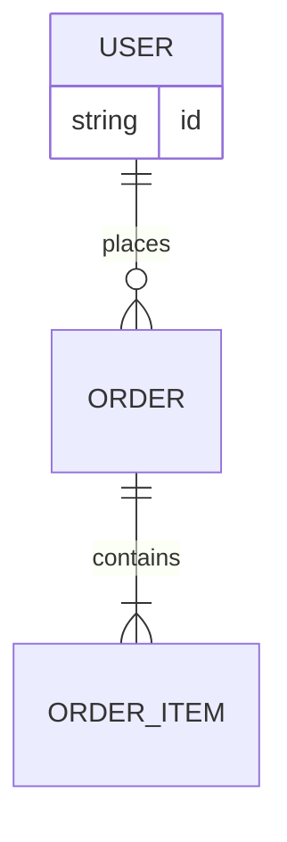

# ER Diagram（テーブル間の関係）
目的：エンティティとリレーションを手早く可視化し、データ構造の合意を取れるようになる。

## 最小雛形

## よく使う
- 多重度：`||`（1）、`o{`（0..n）、`|{`（1..n）など
- 属性リスト：エンティティ名の直後に `{ }` で列を定義
- 複合主キー：`PK` や `FK` を属性名に添えて明示
- コメント：`%% コメント` でメモを挿入

## 演習
1. `PRODUCT` エンティティを追加し、`ORDER_ITEM` と `PRODUCT` を `|o`（多対1）で結び付けよう。
2. `USER` に `email string` 属性を追加し、必要であれば `UNIQUE` と注記すること。

## 注意
- エンティティ名は大文字で統一すると見やすい。
- 循環参照がある場合はサブグラフに分けるか、説明文で補完する。
