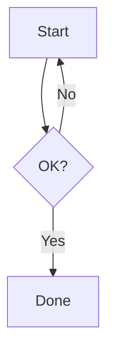
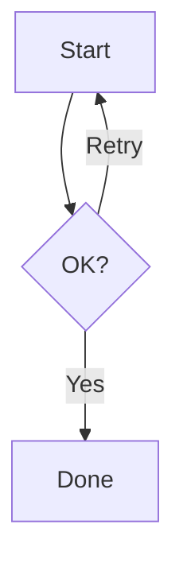
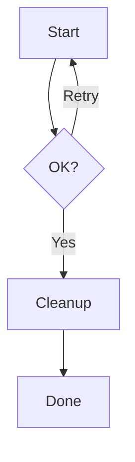
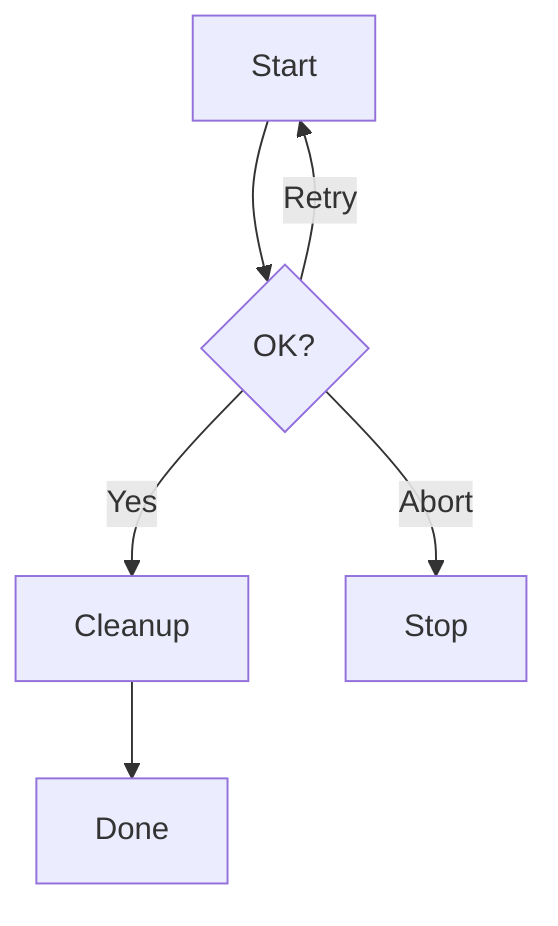

# フローチャート入門

## 目的
- `playground.mmd` に記述する基本的なフローチャート記法を体験し、条件分岐とループを自分の手で書き換えられるようになる。
- 指示どおりにコードを差し替えると図がどう変化するかを即座に確認する。

## スタートコード
`playground.mmd` が空の場合は、以下をすべて貼り付けて保存してください。

---

### ハンズオン1: 分岐にラベルを付ける
1. 上記コード全体を次の内容に置き換えて保存してください。

2. プレビューで「Retry」という文字が分岐の線上に表示されることを確認しましょう。

---

### ハンズオン2: 新しい工程を挿入する
1. 先ほどのコードを次の内容に置き換えてください。`C[Done]` の前に `D[Cleanup]` を追加しています。

2. プレビューで「Cleanup」ノードが追加され、`Done` の手前に表示されていることを確認してください。

---

### ハンズオン3: 別の経路を作る
1. さらにコードを次の内容に置き換えます。

2. 「Abort」経路が追加され、`Stop` ノードへ直接移動できることを確認しましょう。

---

## 振り返り
- `-->|テキスト|` を使うと矢印にラベルを付けられる。
- ノード ID（`A`, `B` など）を再利用するだけで分岐を増やせる。
- ノードと矢印を追加・差し替えるとフローチャートがどのように変わるか、プレビューで即確認できる。
