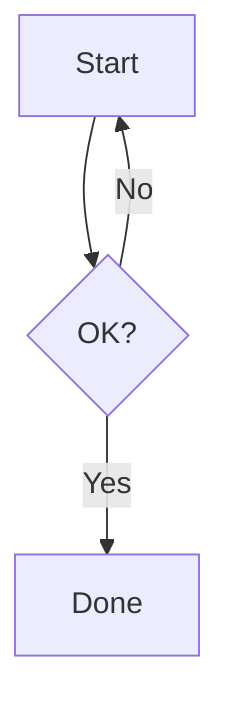

# Flowchart（最小セット）
目的：分岐と繰り返しをシンプルな図形で表現し、工程の全体像を共有できるようになる。

## 最小雛形

## よく使う
- フロー方向：`TD`（縦）、`LR`（横）
- ノード形状：`[長方形]`、`(丸)`、`{ひし形}`
- 分岐ラベル：`-->|Yes|` のように矢印中央へ
- サブグラフ：`subgraph Name ... end`

## 演習
1. `B -- No --> A` を `B -->|Retry| A` に書き換え、再試行を明示しよう。
2. `C[Done]` の前に `D[Cleanup]` を挿入し、完了前の片付けステップを追加せよ。

## 注意
- 同じノード ID は再利用可能だが、意味がぶれないよう管理する。
- あまりにノード数が多い場合はサブグラフでグルーピングする。
