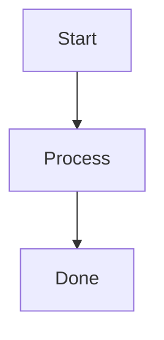

# フローチャート入門

## スタートコード
右上のエディタが空の場合は、以下をすべて貼り付けて保存してください。



シンプルな3ステップのフローチャートです。`A`、`B`、`C` はノードのIDで、`[テキスト]` の中が表示される内容です。

**記法のポイント**:
- `flowchart TD`: TD は Top-Down（上から下）を意味します
- `A[Start]`: 角丸四角形のノード
- `-->`: 矢印でノードを接続

---

### ハンズオン1: 判定ノードで分岐させる

`B[Process]` を `B{OK?}` に変更してください。さらに、`B --> C[Done]` の後に以下の1行を追加してください：
```mermaid
  B -- No --> A
```

プレビューで `B` がひし形（判定ノード）になり、Yes/No の2つの経路に分かれます。`{テキスト}` でひし形ノードを作れます。

---

### ハンズオン2: ループを作る

`B --> C[Done]` を `B -- Yes --> C[Done]` に変更してください。

プレビューで Yes 側の矢印に「Yes」ラベルが表示されます。`-- ラベル -->` の記法で矢印にラベルを付けられます。これで「OK? → No なら最初に戻る、Yes なら Done」というループが完成しました。

---

### ハンズオン3: ノード形状を変える

`A[Start]` を `A((Start))` に、`C[Done]` を `C((Done))` に変更してください。

プレビューで開始と終了のノードが円形になります。`((テキスト))` で円形ノードを作れます。開始/終了を円形にするのはフローチャートの一般的な慣習です。

---

### ハンズオン4: フローの向きを変える

`flowchart TD` を `flowchart LR` に書き換えてください。

プレビューでフローチャート全体が横向き（左から右）に変わります。`TD`（Top-Down）と `LR`（Left-Right）で図の向きを制御できます。

---

## 振り返り
- `[テキスト]` で角丸四角形、`{テキスト}` でひし形、`((テキスト))` で円形のノードを作れる
- `-- ラベル -->` で矢印にラベルを付けられる
- 同じノードIDを再利用することで分岐やループを作れる
- `TD`（上→下）や `LR`（左→右）でフローの向きを制御できる
