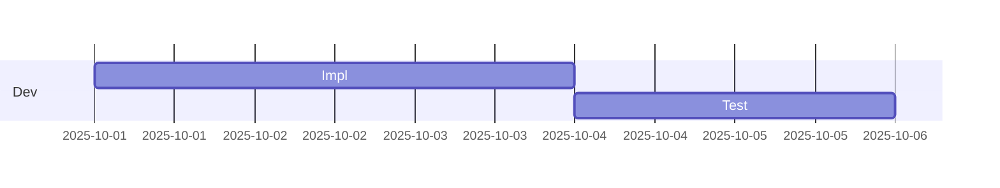

# ガントチャート入門

## 目的
- 日付と期間を指定する基本構文を操作し、タスクの依存関係を視覚的に確認する。
- 指示どおりに `playground.mmd` を差し替えて、スケジュールがどう変化するかを理解する。

## スタートコード
以下を `playground.mmd` に貼り付けて保存してください。



---

### ハンズオン1: タスクにリソース名を付ける
1. 上記コードを次の内容に置き換えてください。タスクの後ろに `, Alice` などの担当者を追加します。

```mermaid
gantt
  dateFormat  YYYY-MM-DD
  section Dev
  Impl      :a1, 2025-10-01, 3d, Alice
  Test      :after a1, 2d, Bob
```

2. プレビューで担当者名が括弧付きで表示されることを確認しましょう。

---

### ハンズオン2: 新しいセクションを追加する
1. コードを以下に置き換え、`QA` セクションとタスクを増やします。

```mermaid
gantt
  dateFormat  YYYY-MM-DD
  section Dev
  Impl      :a1, 2025-10-01, 3d, Alice
  Test      :after a1, 2d, Bob

  section QA
  Prepare   :a2, after a1, 1d, Carol
  Execute   :after a2, 2d, Dave
```

2. ガントチャートに新しいセクションとタスクが表示されることを確認しましょう。

---

### ハンズオン3: マイルストーンを追加する
1. 最後に以下のコードへ置き換え、リリース日をマイルストーンで表現します。

```mermaid
gantt
  dateFormat  YYYY-MM-DD
  section Dev
  Impl      :a1, 2025-10-01, 3d, Alice
  Test      :after a1, 2d, Bob

  section QA
  Prepare   :a2, after a1, 1d, Carol
  Execute   :after a2, 2d, Dave

  section Release
  Launch    :milestone, 2025-10-08, 0d, Team
```

2. `Launch` がダイヤアイコンで表示されることを確認してください。

---

## 振り返り
- `dateFormat` はチャート全体のフォーマットを決める。
- タスクのラベル末尾に担当者を記載できる（複数の場合はカンマ区切り）。
- `:milestone` を付けると期間ゼロのマイルストーンとして描画される。
