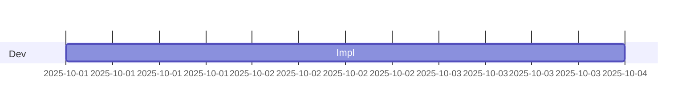

# ガントチャート入門

## スタートコード
右上のエディタが空の場合は、以下をすべて貼り付けて保存してください。



シンプルなガントチャートです。タスクの開始日と期間を指定してスケジュールを視覚化します。

**記法のポイント**:
- `gantt`: ガントチャートの宣言
- `dateFormat`: 日付フォーマットの指定
- `section セクション名`: タスクのグループ
- `タスク名 :開始日, 期間`: タスクの定義

---

### ハンズオン1: タスクを追加する

4行目の後に `Test :after Impl, 2d` を追加してください。

プレビューで `Test` タスクが `Impl` の後に続いて表示されます。`after タスク名` で依存関係を表現できます。

---

### ハンズオン2: タスクにIDと担当者を付ける

3行目を `Impl :a1, 2025-10-01, 3d` に、4行目を `Test :after a1, 2d` に変更してください。

タスクにID（`a1`）を付けることで、他のタスクから参照できます。依存関係が明確になります。

---

### ハンズオン3: 新しいセクションを追加する

最終行の後に以下を追加してください：
```mermaid
  section QA
  Review :after a1, 2d
```

プレビューで新しいセクション `QA` が表示されます。`section` でタスクをグループ化できます。

---

### ハンズオン4: マイルストーンを追加する

最終行の後に `Release :milestone, 2025-10-08, 0d` を追加してください。

プレビューでマイルストーンがダイヤ型で表示されます。`milestone` と期間 `0d` で重要な日付を強調できます。

---

## 振り返り
- `after タスク名` または `after ID` でタスクの依存関係を表現
- `:ID, 開始日, 期間` の形式でタスクを定義
- `section` でタスクをグループ化
- `milestone` と期間 `0d` でマイルストーンを表現
