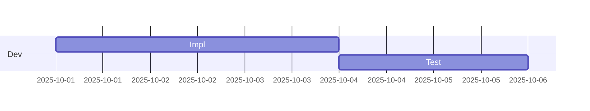

# Gantt Chart（計画の共有）
目的：開発フェーズの開始日と依存関係を示し、スケジュールの共通認識を作る。

## 最小雛形

## よく使う
- 日付フォーマット：`dateFormat YYYY-MM-DD`
- タスク構文：`ラベル :id, 開始日, 期間`
- 依存関係：`after` を使って前タスクに連結
- セクション分け：`section 名前` でフェーズを整理

## 演習
1. `Review` タスクを `Test` の後に 1 日で追加しよう。
2. 新しいセクション `Deploy` を作り、`Release :milestone, 2025-10-10, 0d` を追加してみる。

## 注意
- 期間は `3d` や `1w` のように単位を忘れない。
- 依存の循環が発生すると描画できないので順序を確認する。
