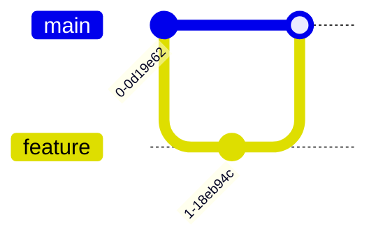
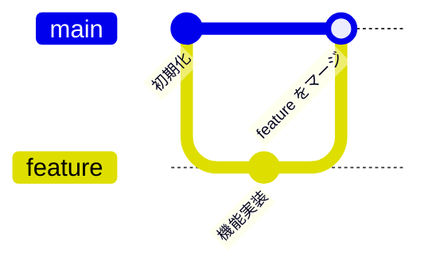
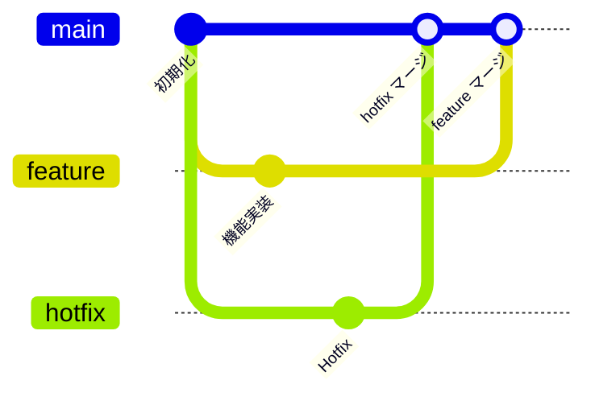

# Git グラフ入門

## 目的
- ブランチ作成・チェックアウト・マージの基本操作を Git グラフで可視化する。
- 指定されたコードを順番に貼り付け、履歴がどのように変わるか体験する。

## スタートコード
`playground.mmd` に以下を貼り付けて保存してください。

---

### ハンズオン1: コミットメッセージを追加する
1. 上記コードを次の内容に置き換え、`commit` に説明を付けます。

2. 各ノードにラベルが付いていることを確認してください。

---

### ハンズオン2: ホットフィックスブランチを追加する
1. コードを以下の内容に置き換えます。

2. `hotfix` ブランチが main から分岐し、マージされる流れを確認してください。

---

### ハンズオン3: タグを追加する
1. 最後に以下のコードへ置き換え、タグを付けてリリースを表現します。

2. タグ `v0.1` と `v0.2` が表示され、履歴の区切りが視覚化されることを確認しましょう。

---

## 振り返り
- `branch` / `checkout` / `merge` を組み合わせるだけでブランチ戦略を表せる。
- `commit id: "メッセージ"` でノードにラベルを付けると読みやすい。
- `tag name: "v1.0"` を適所に挿入するとリリースポイントが明確になる。
