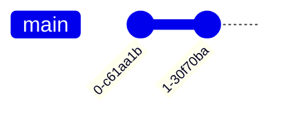

# Gitグラフ入門

## スタートコード
右上のエディタが空の場合は、以下をすべて貼り付けて保存してください。



シンプルなGitグラフです。コミット履歴を視覚化します。

**記法のポイント**:
- `gitGraph`: Gitグラフの宣言
- `commit`: コミットを追加
- ブランチ操作は `branch`、`checkout`、`merge` で表現

---

### ハンズオン1: コミットにメッセージを付ける

各 `commit` を `commit id: "初期化"` と `commit id: "機能追加"` に変更してください。

プレビューでコミットノードにメッセージが表示されます。`id: "メッセージ"` でコミットに説明を付けられます。

---

### ハンズオン2: ブランチを作成する

2行目の後に以下の2行を追加してください：
```mermaid
  branch feature
  checkout feature
```

プレビューで `feature` ブランチが main から分岐します。`branch` で新しいブランチを作成し、`checkout` でブランチを切り替えます。

---

### ハンズオン3: ブランチにコミットを追加する

最終行の後に `commit id: "新機能"` を追加してください。

プレビューで `feature` ブランチに新しいコミットが追加されます。`checkout` で切り替えたブランチにコミットが記録されます。

---

### ハンズオン4: ブランチをマージする

最終行の後に以下を追加してください：
```mermaid
  checkout main
  merge feature
```

プレビューで `feature` ブランチが `main` にマージされます。`merge` でブランチを統合できます。

---

## 振り返り
- `commit id: "メッセージ"` でコミットに説明を付けられる
- `branch 名前` で新しいブランチを作成
- `checkout 名前` でブランチを切り替え
- `merge 名前` でブランチをマージ
