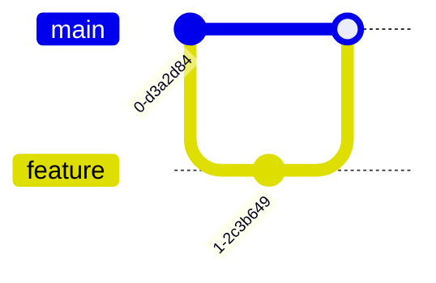

# Git Graph（履歴の俯瞰）
目的：ブランチ戦略やマージの流れを図解し、リリース方針を共有できるようにする。

## 最小雛形

## よく使う
- コミット：`commit` で 1 コミット追加
- ブランチ作成：`branch name`
- チェックアウト：`checkout name`
- タグ：`tag label` でラベルを追加

## 演習
1. `hotfix` ブランチを `main` から切り、1 コミット後すぐに `main` へマージしてみよう。
2. `main` の最後のコミットに `tag v1.0` を追加し、図に反映させる。

## 注意
- `checkout` するとその後の `commit` はそのブランチに付く点に注意。
- 図が長くなりすぎる場合は `commit id: "説明"` のようにコメントで補足する。
