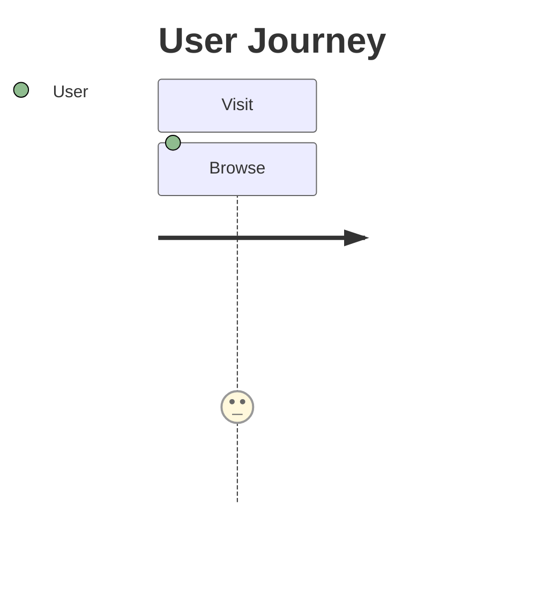

# ユーザージャーニー入門

## スタートコード
右上のエディタが空の場合は、以下をすべて貼り付けて保存してください。



シンプルなユーザージャーニーマップです。ユーザーの行動と感情スコアを視覚化します。

**記法のポイント**:
- `journey`: ユーザージャーニーの宣言
- `title タイトル`: ジャーニーのタイトル
- `section セクション名`: フェーズの区切り
- `アクション: スコア: 役割`: ステップの定義（スコアは1〜5）

---

### ハンズオン1: 新しいステップを追加する

`Browse: 3: User` の次の行に `Sign up: 4: User` を追加してください。

プレビューで新しいステップが追加され、スコア4（満足度が高い）が色で表現されます。数値が大きいほど満足度が高いことを示します。

---

### ハンズオン2: 別の役割を追加する

`Browse: 3: User` の次の行に `Get help: 5: Support` を追加してください。

プレビューで `Support` という別の役割が表示されます。役割ごとに色が変わり、関係者が明確になります。

---

### ハンズオン3: 新しいセクションを追加する

最終行の後に以下を追加してください：
```mermaid
  section Onboard
    Tutorial: 4: User
    Setup: 3: User
```

プレビューで新しいフェーズ `Onboard` が追加されます。`section` でジャーニーを段階的に表現できます。

---

### ハンズオン4: 感情スコアを調整する

各ステップのスコアを変更してみてください（例：`Browse: 5: User`）。

プレビューでステップの色が変わります。スコア1〜2は不満、3は中立、4〜5は満足を表します。

---

## 振り返り
- `アクション: スコア: 役割` の形式でステップを定義
- スコアは1〜5で、数値が大きいほど満足度が高い
- `section` でジャーニーをフェーズ分け
- 役割ごとに色が変わり、複数の関係者を表現できる
