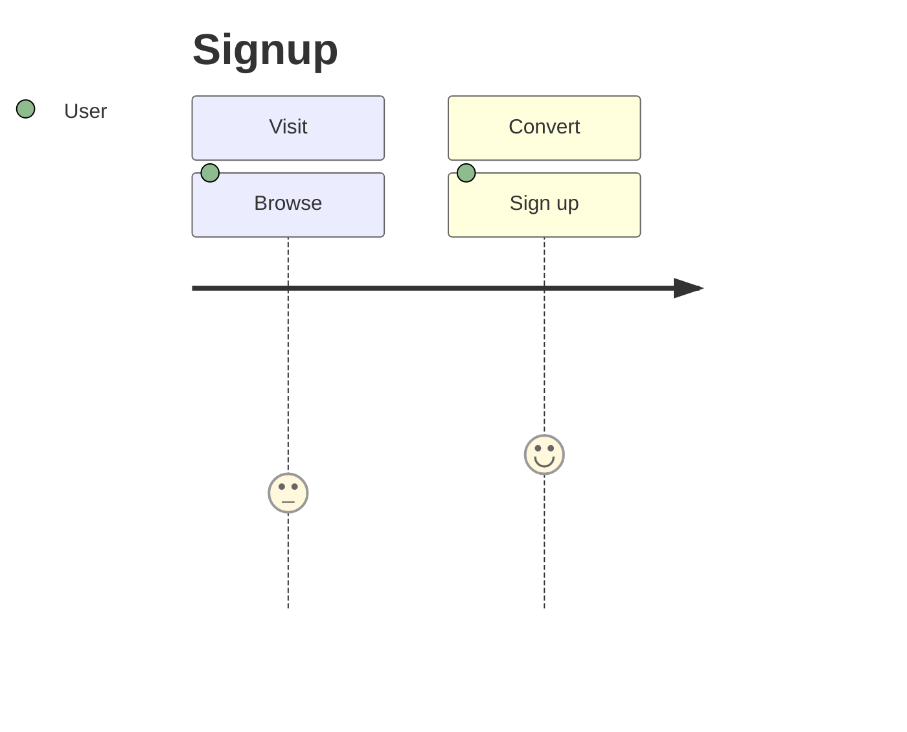

# Journey（体験の分解）
目的：ユーザーの感情や行動をステップごとに整理し、改善ポイントを見つけられるようにする。

## 最小雛形

## よく使う
- ステップ書式：`アクション: 感情スコア: 役割`
- 感情スコア：1〜5（低いほどネガティブ）
- セクション：`section` でフェーズを区切る
- タイトル：`title` を冒頭に置く

## 演習
1. `Support` セクションを追加し、`Ask help: 2: User` を挿入してみよう。
2. `Browse` の感情スコアを 4 に変更し、変化を確認する。

## 注意
- スコアは整数のみ対応。小数を使うと描画に失敗する。
- セクションが多いと横スクロールが必要になるので 4 つ程度までに抑える。
