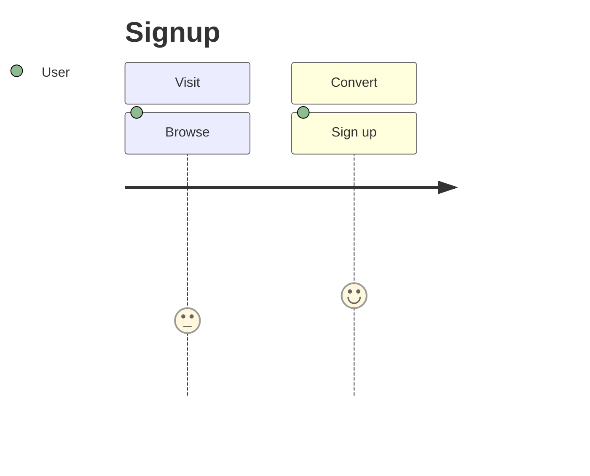
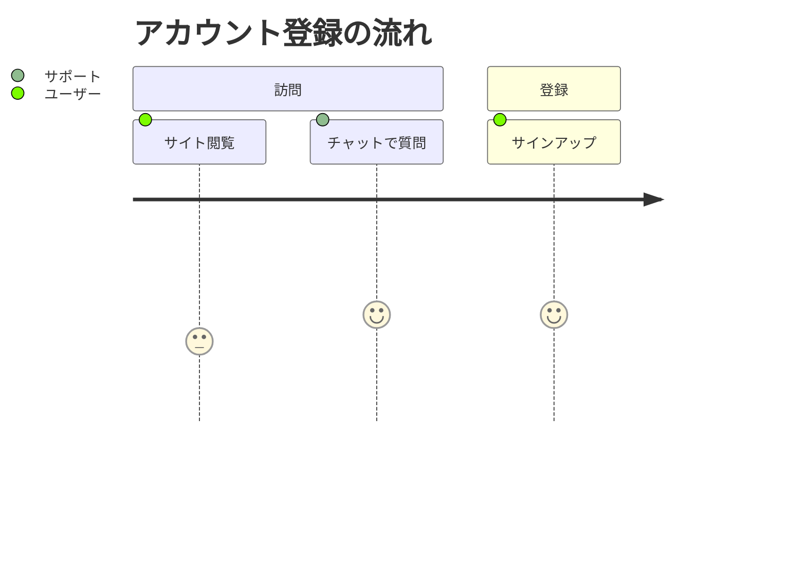
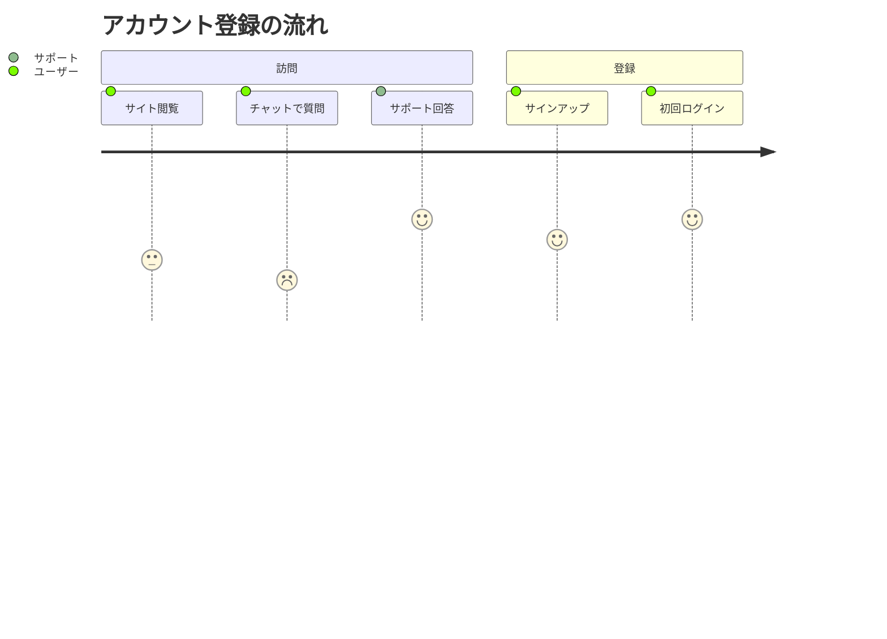
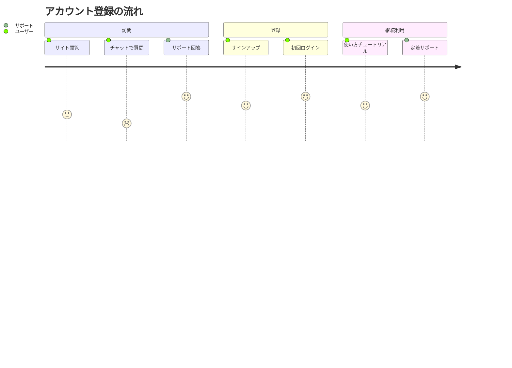

# ジャーニーマップ入門

## 目的
- ユーザー行動と感情スコアを記述し、フェーズごとの体験を可視化する。
- 指定されたコードを順番に貼り付けて、ジャーニーの変化を追う。

## スタートコード
以下を `playground.mmd` に貼り付けて保存してください。

---

### ハンズオン1: 役割を増やす
1. コードを次の内容に置き換えてください。サポート担当を追加しています。

2. サポート担当が別役割として表示されていることを確認しましょう。

---

### ハンズオン2: 感情スコアを変化させる
1. 次のコードへ置き換え、スコアと役割を追加します。

2. 各ステップの感情スコアが色で変化していることを確認してください。

---

### ハンズオン3: 新しいセクションを追加する
1. 最後に以下のコードへ置き換え、継続利用フェーズを追加します。

2. 新しいセクションが下部に追加され、ステップが増えていることを確認しましょう。

---

## 振り返り
- `section` ごとにフェーズを分け、: の後ろの数字で感情スコアを表す。
- 役割を変えると色や位置が変わり、関係者がひと目でわかる。
- ステップを増やすときは、スコア・役割・ラベルをセットで追加しよう。
