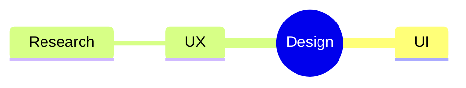

# Mindmap（発想の展開）
目的：テーマを放射状に分解し、関係する要素を素早く洗い出せるようにする。

## 最小雛形

## よく使う
- ルートノード：`root((Title))` のように装飾可能
- 階層追加：インデントで親子関係を表現
- ノード装飾：`:::className` でスタイルを割り当て
- コメント：`%%` でメモを残せる

## 演習
1. `UI` の子に `Components` と `Interaction` を追加し、詳細化してみよう。
2. `UX` の下に `Testing` を追加し、バランスの取れたマインドマップに仕上げる。

## 注意
- 階層が深すぎると図が崩れるため、3〜4 層までに留める。
- 日本語ラベルでも問題ないが、等幅フォントを意識すると読みやすい。
