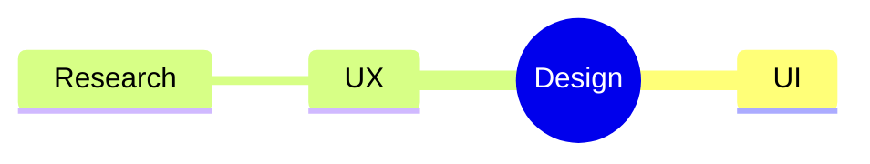
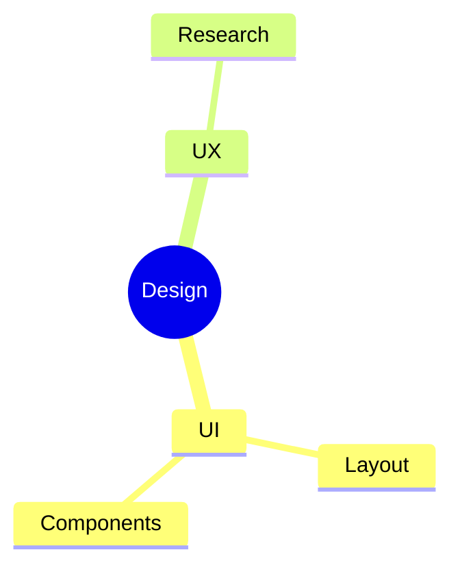
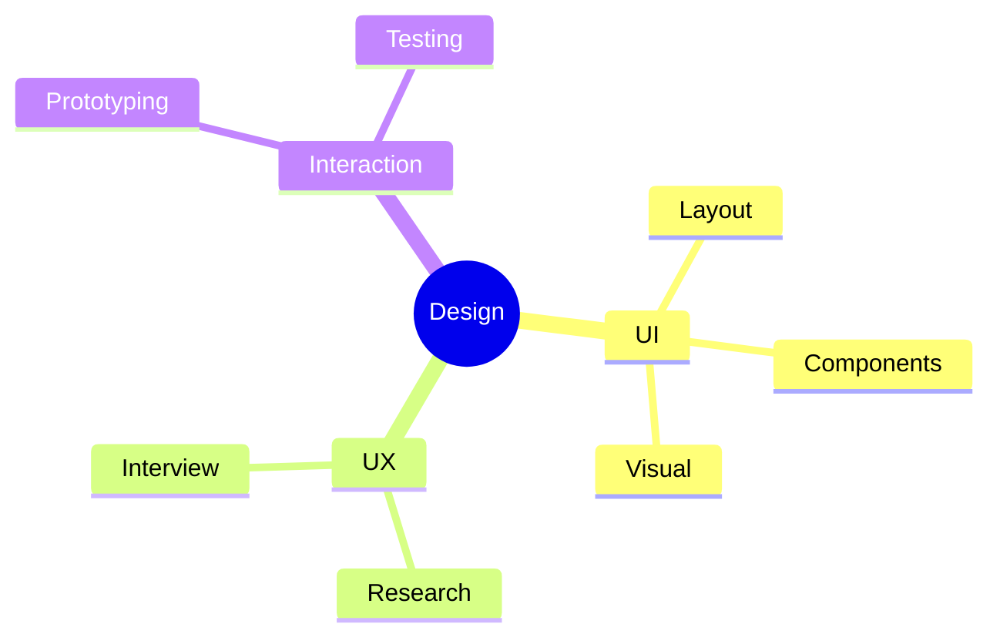

# マインドマップ入門

## 目的
- 中心テーマから枝を広げる基本操作を体験し、階層構造を視覚的に理解する。
- 指示どおりに `playground.mmd` を書き換え、枝の増減を試す。

## スタートコード
以下を `playground.mmd` に貼り付けて保存してください。

---

### ハンズオン1: 子ノードを追加する
1. コードを次の内容に置き換え、`UI` に子ノードを増やします。

2. `UI` の下に 2 つの項目がぶら下がることを確認しましょう。

---

### ハンズオン2: 新しい枝を作る
1. 以下のコードへ置き換え、`Visual` と `Interaction` の枝を追加します。

2. 相互作用 (Interaction) の枝が追加され、階層が増えていることを確認してください。

---

### ハンズオン3: サブトピックにメモを付ける
1. 最後に次のコードへ置き換え、文字列コメントを追加します。

2. `Prototyping` の下にコメントが表示されることを確認しましょう。

---

## 振り返り
- インデントを増やすだけで子ノードを追加できる。
- 同じインデントを使えば兄弟ノードになり、レベルを変えると階層が変化する。
- `%%` でメモを入れられるので、学習用の補足を書いておくと便利。
