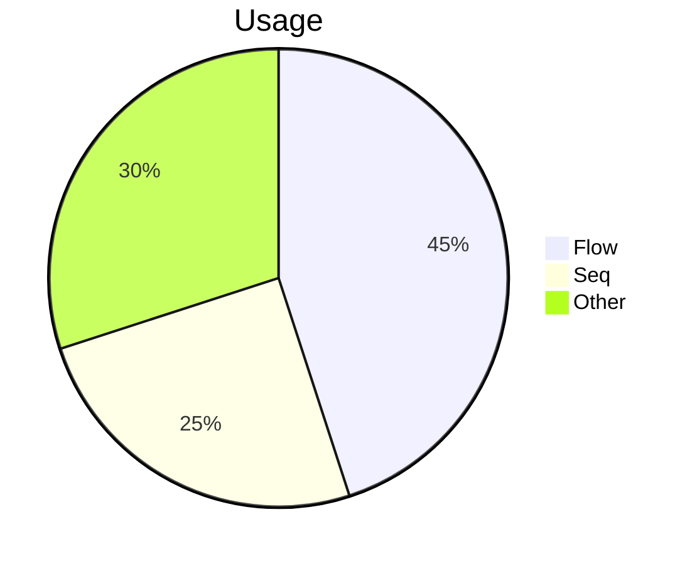
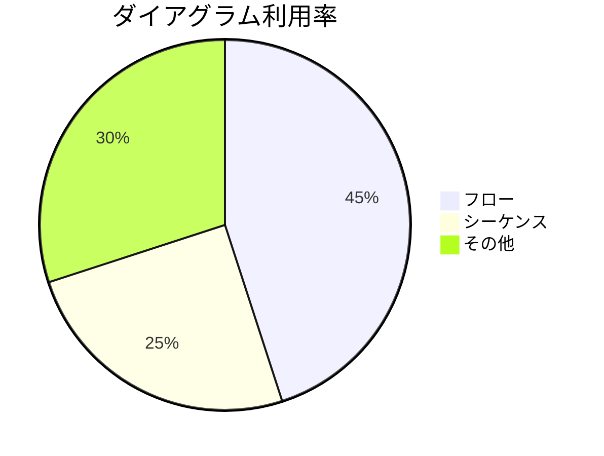
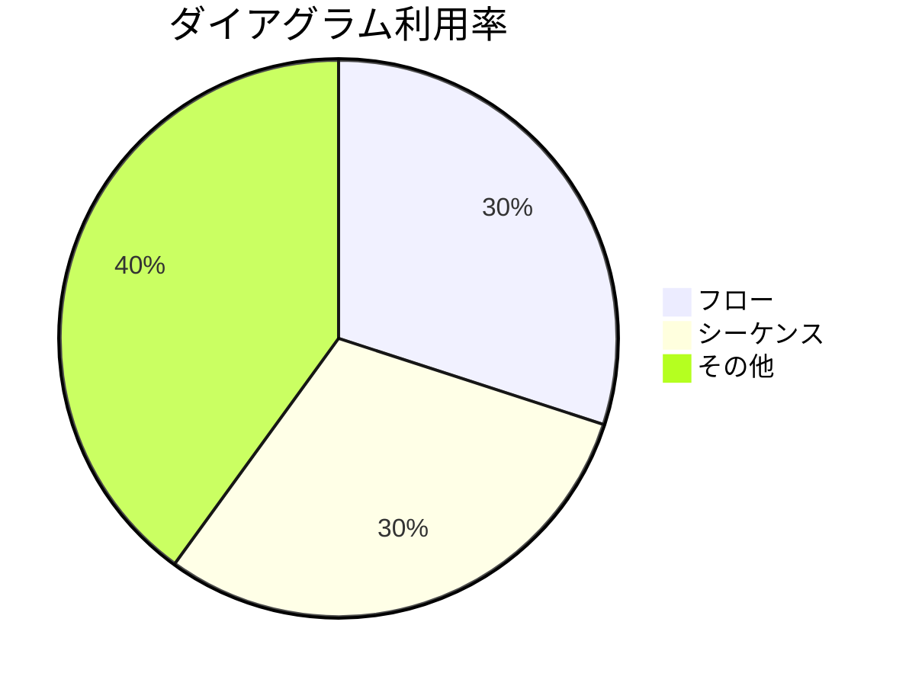
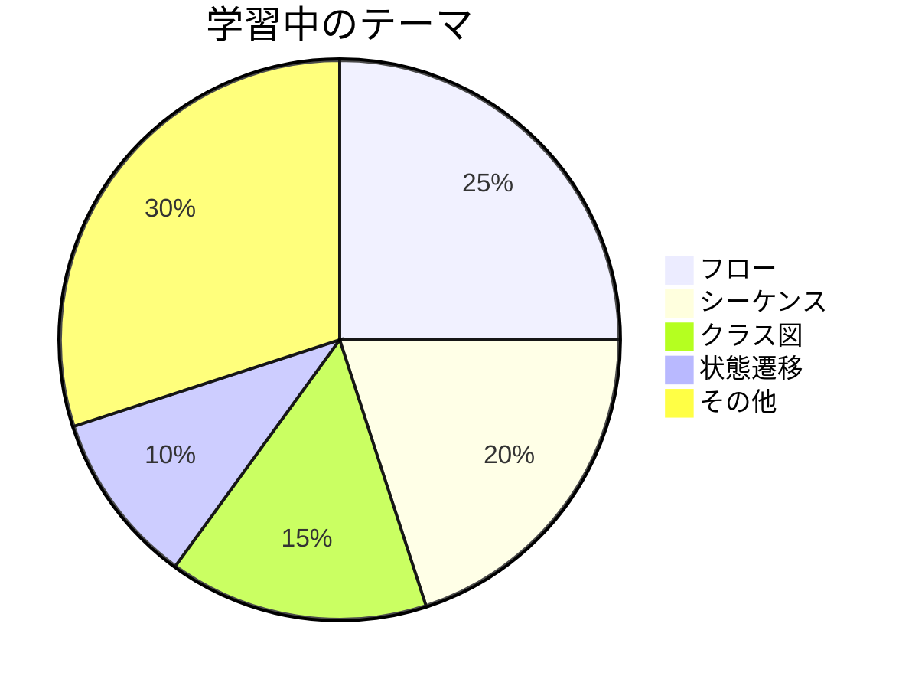

# 円グラフ入門

## 目的
- `pie` 記法で割合を記述し、数値を変更したときの見た目の違いを確認する。
- 指定されたコードをそのまま貼り付けて構成比の変化を可視化する。

## スタートコード
`playground.mmd` に以下を貼り付けて保存してください。

---

### ハンズオン1: ラベルの書き方に慣れる
1. コードを次の内容に置き換え、ラベルを日本語にします。

2. プレビューでタイトルとラベルが日本語表示になることを確認してください。

---

### ハンズオン2: 割合を変えて比較する
1. 次のコードに置き換え、数値を変更します。

2. 円グラフのサイズが変わり、`その他` が最も大きくなったことを確認しましょう。

---

### ハンズオン3: 内訳を増やす
1. 最後に以下のコードへ置き換え、新しいカテゴリを追加します。

2. 円グラフに 5 分割が表示されることを確認してください。

---

## 振り返り
- ラベルは必ず二重引用符で囲む。
- 数値の合計が 100 でなくても表示され、相対比で描画される。
- 項目が多すぎると読みづらくなるので、カテゴリを増やすときは比率も調整しよう。
