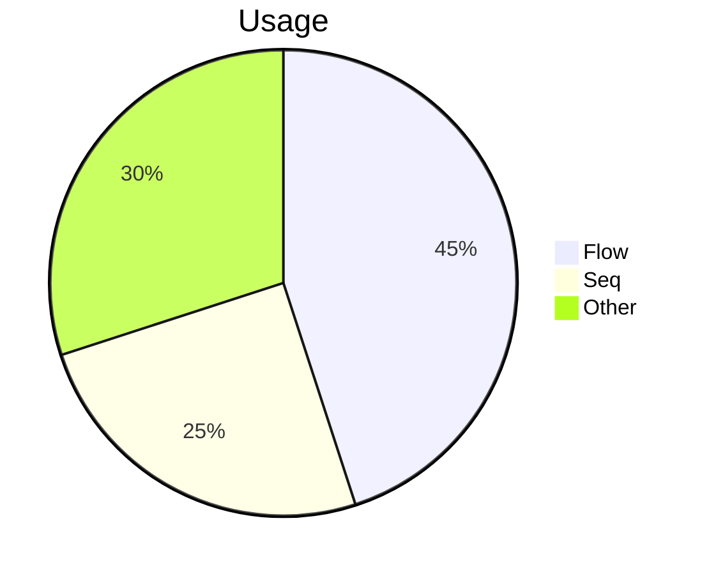

# Pie Chart（配分の可視化）
目的：比率を直感的に示し、重点項目のバランスを掴めるようにする。

## 最小雛形

## よく使う
- タイトル：`pie title ...`
- データ行：`"ラベル" : 数値`
- 色の調整：`classDef` は使えないため、凡例で補足
- 単位：割合でも生データでも描画可能

## 演習
1. `Other` を分解し、`"Class": 10` と `"State": 20` の 2 項目に置き換えよう。
2. 合計が 100 でなくても描画できることを確認するため、値を 10・20・30 に変更してみる。

## 注意
- 項目が多すぎると識別しづらくなる。5 項目程度までに抑える。
- ラベルに引用符を忘れるとエラーになる。
