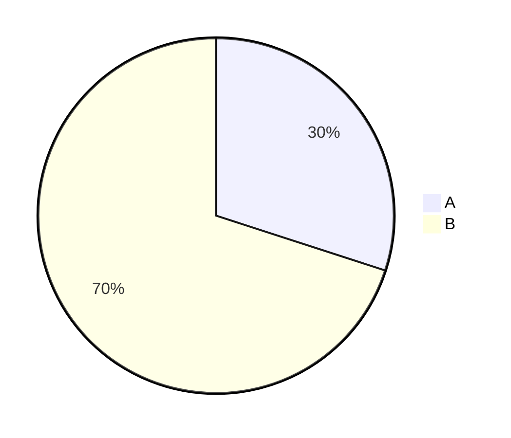

# 円グラフ入門

## スタートコード
右上のエディタが空の場合は、以下をすべて貼り付けて保存してください。



シンプルな円グラフです。ラベルと数値で構成比を視覚化します。

**記法のポイント**:
- `pie`: 円グラフの宣言
- `"ラベル" : 数値`: データの定義
- 数値は相対的な比率で、合計が100である必要はない

---

### ハンズオン1: タイトルを追加する

`pie` を `pie title Usage` に変更してください。

プレビューで円グラフの上に「Usage」というタイトルが表示されます。`title タイトル` でグラフにタイトルを付けられます。

---

### ハンズオン2: データを追加する

最終行の後に `"C" : 50` を追加してください。

プレビューで円グラフが3分割されます。データの相対比率に応じて自動的に円が分割されます。

---

### ハンズオン3: 比率を変更する

`"A" : 30` を `"A" : 20` に、`"B" : 70` を `"B" : 30` に変更してください。

プレビューで各セクションのサイズが変わります。数値を変更するだけで視覚的な比率が即座に反映されます。

---

### ハンズオン4: 日本語ラベルを使う

すべてのデータ行を以下に変更してください：
```mermaid
  "フロー" : 20
  "シーケンス" : 30
  "その他" : 50
```

プレビューでラベルが日本語表示になります。ラベルは必ず二重引用符で囲めば、日本語や空白を含む文字列も使えます。

---

## 振り返り
- `title タイトル` でグラフにタイトルを付けられる
- `"ラベル" : 数値` の形式でデータを定義
- 数値は相対比率で、合計が100でなくても表示される
- ラベルは二重引用符で囲む必要がある
