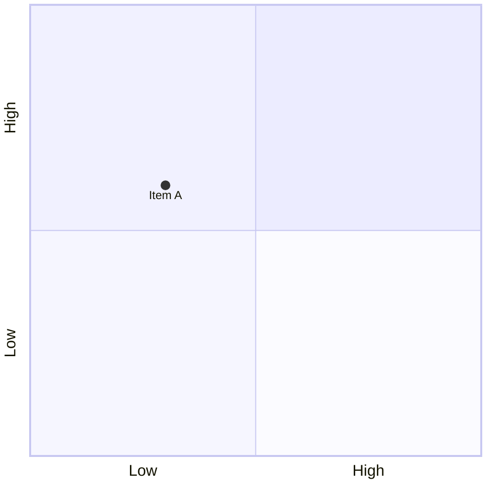

# 象限図入門

## スタートコード
右上のエディタが空の場合は、以下をすべて貼り付けて保存してください。



シンプルな象限図（マトリクス）です。2つの軸で項目を評価・配置します。

**記法のポイント**:
- `quadrantChart`: 象限図の宣言
- `x-axis 左ラベル --> 右ラベル`: 横軸の定義
- `y-axis 下ラベル --> 上ラベル`: 縦軸の定義
- `"項目名": [x座標, y座標]`: データポイント（座標は0〜1）

---

### ハンズオン1: タイトルを追加する

1行目を `quadrantChart title Priority Matrix` に変更してください。

プレビューで図の上にタイトルが表示されます。`title タイトル` でマトリクスのタイトルを付けられます。

---

### ハンズオン2: 軸のラベルを変更する

2行目を `x-axis 緊急度低 --> 緊急度高` に、3行目を `y-axis 重要度低 --> 重要度高` に変更してください。

プレビューで軸のラベルが日本語になります。軸のラベルで評価基準を明確にできます。

---

### ハンズオン3: データポイントを追加する

最終行の後に `"Item B": [0.8, 0.2]` を追加してください。

プレビューで新しいポイントが配置されます。座標で項目の位置を指定できます（0が左/下、1が右/上）。

---

### ハンズオン4: 象限のラベルを追加する

4行目の後に以下を追加してください：
```mermaid
  quadrant-1 すぐやる
  quadrant-2 計画する
  quadrant-3 後回し
  quadrant-4 やらない
```

プレビューで各象限にラベルが表示されます。`quadrant-1` から `quadrant-4` で各象限の意味を説明できます（右上が1、左上が2、左下が3、右下が4）。

---

## 振り返り
- `title タイトル` で図のタイトルを設定
- `x-axis` と `y-axis` で軸のラベルを定義
- `"項目": [x, y]` で座標を指定（0〜1の範囲）
- `quadrant-1` 〜 `quadrant-4` で各象限にラベルを付けられる
