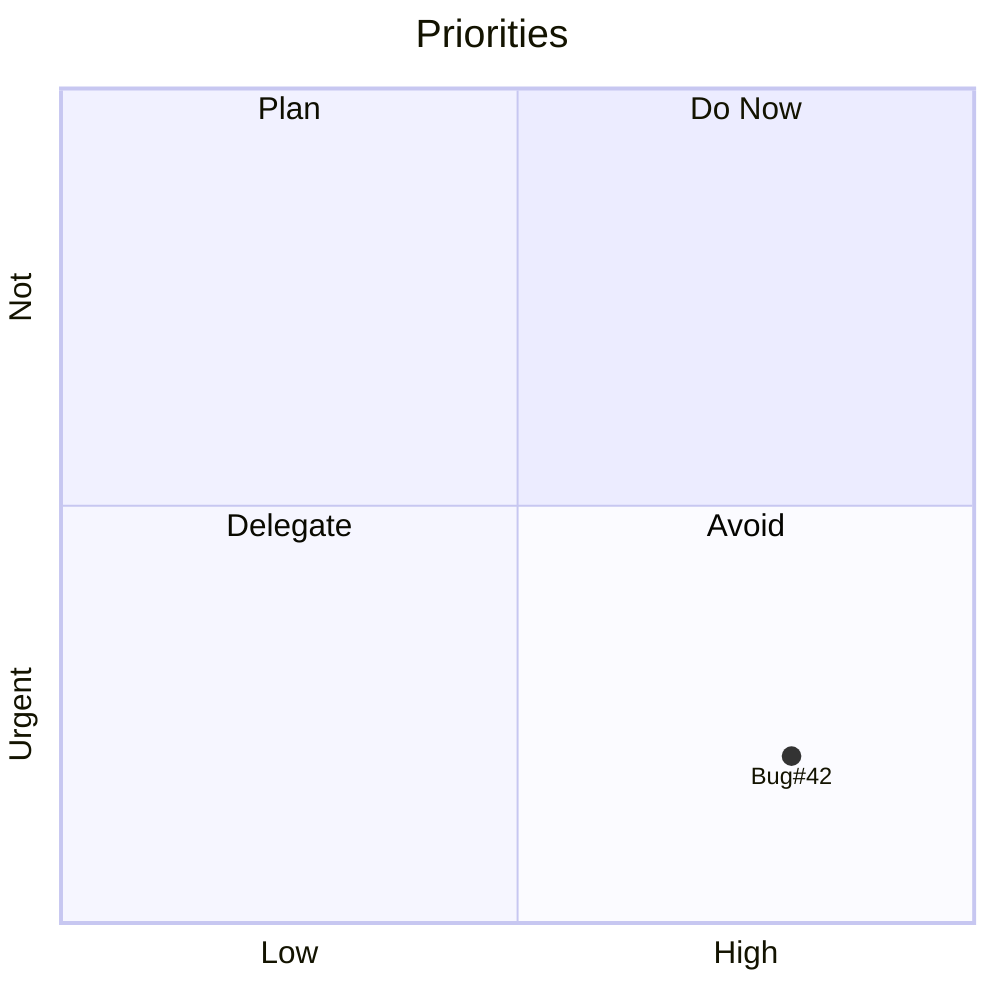
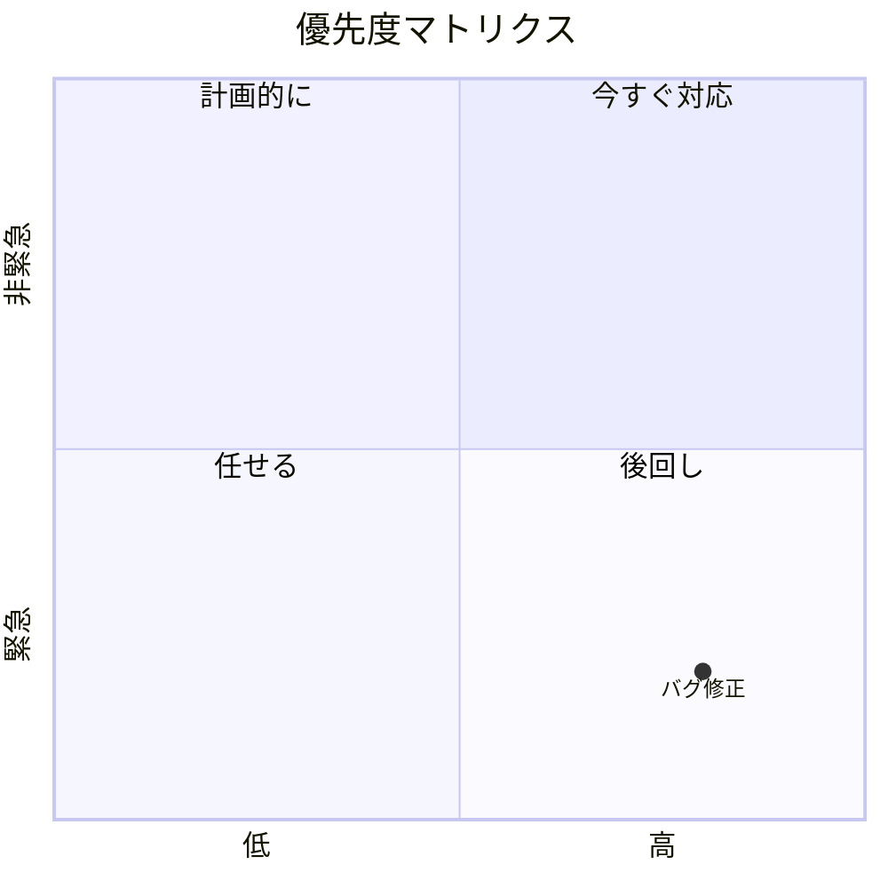
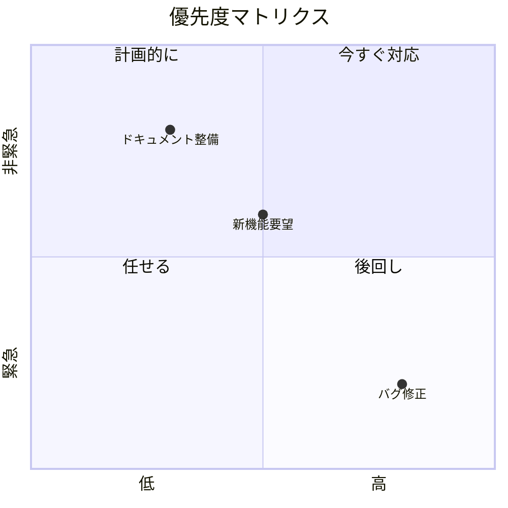
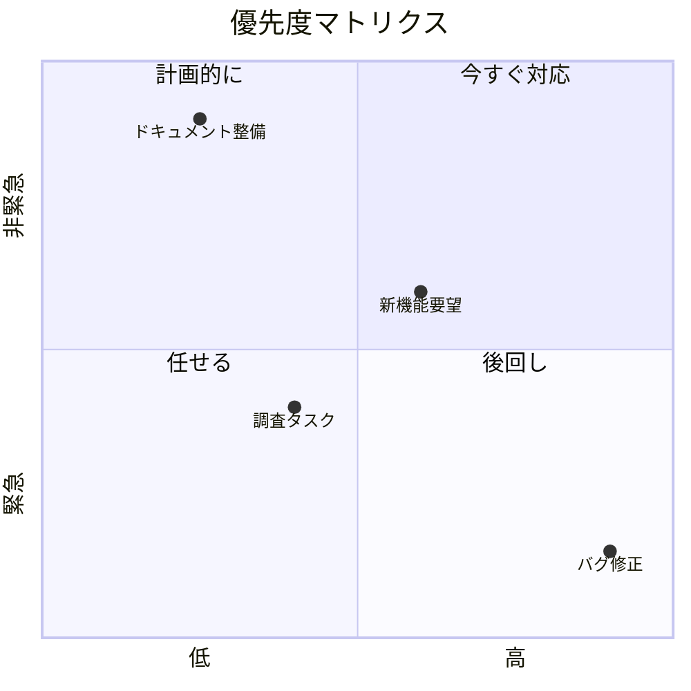

# 優先度マトリクス入門

## 目的
- `quadrantChart` でタスクの重要度・緊急度を手で調整し、座標の意味を理解する。
- 指示どおりに `playground.mmd` を差し替えて、プロット位置の変化を確認する。

## スタートコード
以下を `playground.mmd` に貼り付けて保存してください。

---

### ハンズオン1: タイトルと軸ラベルを日本語にする
1. コードを次の内容に置き換えてください。

2. タイトルと軸ラベルが日本語に変わっていることを確認しましょう。

---

### ハンズオン2: 複数アイテムをプロットする
1. 上記コードを以下に置き換え、案件を増やします。

2. 3 点が配置され、それぞれの象限が異なることを確認しましょう。

---

### ハンズオン3: 位置を調整して優先度を再評価する
1. 最後に以下のコードへ置き換えてください。

2. 座標を変更すると点の位置が動き、優先度の評価が視覚的に変わることを確認してください。

---

## 振り返り
- `x-axis` / `y-axis` は矢印の向きとラベルを一行で定義する。
- 座標は 0〜1 の範囲で指定し、0 が左/下、1 が右/上を意味する。
- 点を追加・位置変更するだけでチームの優先度の捉え方を即座に共有できる。
