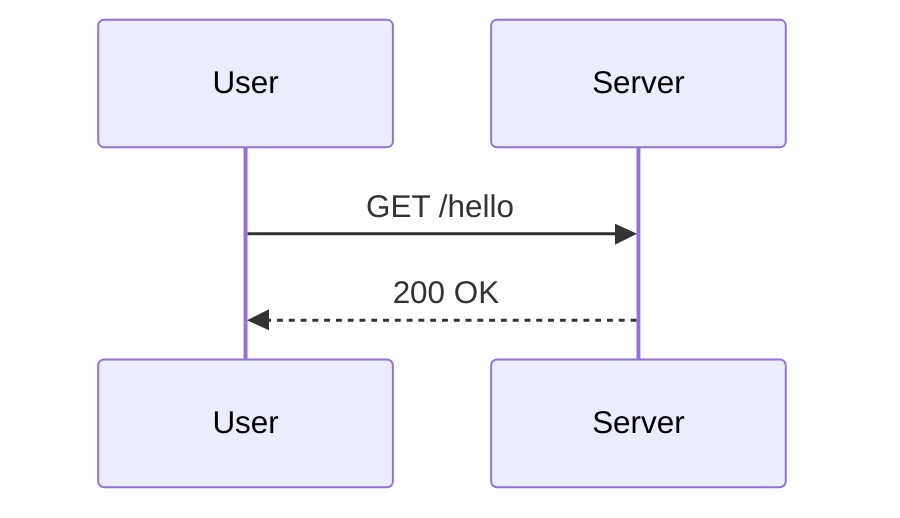
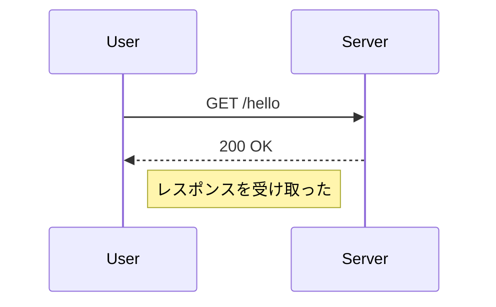
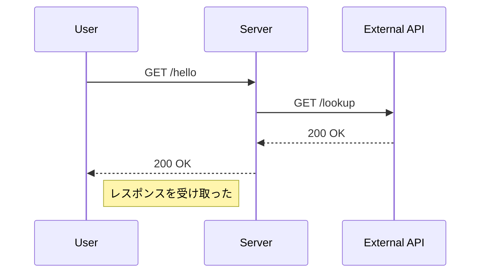
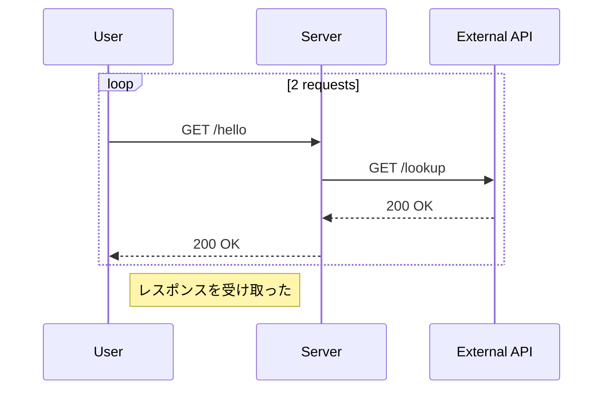

# シーケンス図入門

## 目的
- `sequenceDiagram` のライフライン、メッセージ、ループを手で編集して把握する。
- 指示どおりに `playground.mmd` を書き換えるだけで図の変化を確認する。

## スタートコード
以下を `playground.mmd` に貼り付けて保存してください。

---

### ハンズオン1: 受信メッセージにノートを付ける
1. 上記コードを以下に差し替えてください。最後のレスポンスの下にノートを付けています。

2. プレビューでユーザー側にノートが表示されることを確認しましょう。

---

### ハンズオン2: 外部 API への連携を追記する
1. 上記コード全体を次に置き換えてください。

2. 新しいライフライン `External API` が追加され、API コールの往復が描かれていることを確認してください。

---

### ハンズオン3: 2 回目のリクエストをループで表現する
1. 最後に次のコードへ置き換えます。`loop` ブロックを追加しています。

2. プレビューでループ枠が追加され、同じやり取りが 2 回繰り返されることを確認しましょう。

---

## 振り返り
- `participant` 行を追加するとライフラインが増える。
- `loop タイトル ... end` で繰り返しを視覚的に示せる。
- ノートは `Note right of` / `Note left of` で任意のライフラインに添付できる。
