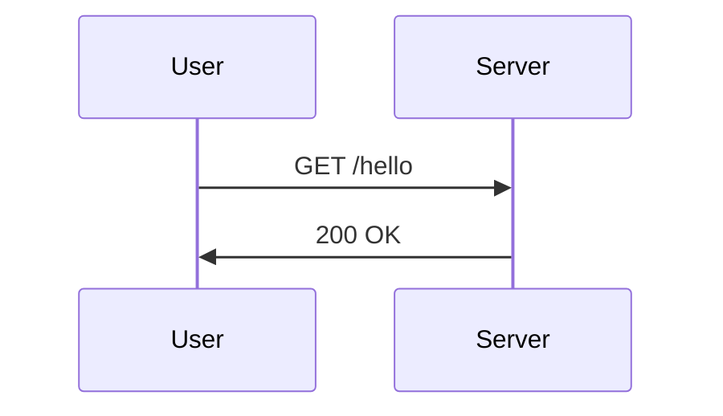

# シーケンス図入門

## スタートコード
右上のエディタが空の場合は、以下をすべて貼り付けて保存してください。



シンプルなリクエスト・レスポンスのシーケンス図です。`participant` で参加者を定義し、`->>` で同期メッセージを表現します。

**記法のポイント**:
- `sequenceDiagram`: シーケンス図の宣言
- `participant A as 表示名`: 参加者（ライフライン）の定義
- `->>`: 実線の矢印（同期メッセージ）

---

### ハンズオン1: レスポンスを点線にする

4行目の `S->>U: 200 OK` を `S-->>U: 200 OK` に変更してください。

プレビューでレスポンスの矢印が点線になります。`-->>` は非同期または応答を表す点線矢印です。

---

### ハンズオン2: 外部APIを追加する

2行目の後に `participant A as External API` を追加し、さらに4行目の前に以下の2行を挿入してください：
```mermaid
  S->>A: GET /lookup
  A-->>S: Data
```

プレビューで新しいライフライン `External API` が追加され、Server から API へのやりとりが表示されます。`participant` を追加するだけで参加者を増やせます。

---

### ハンズオン3: ノートを付ける

最終行の後に `Note right of U: レスポンス受信` を追加してください。

プレビューで User の右側にノートが表示されます。`Note right of` / `Note left of` / `Note over` で説明を追加できます。

---

### ハンズオン4: ループで繰り返しを表現する

3行目から6行目までを `loop 2回リトライ` と `end` で囲んでください：
```mermaid
  loop 2回リトライ
    U->>S: GET /hello
    S->>A: GET /lookup
    A-->>S: Data
    S-->>U: 200 OK
  end
```

プレビューでループ枠が表示され、繰り返し処理が視覚化されます。`loop タイトル ... end` で反復を表現できます。

---

## 振り返り
- `->>` は実線（同期）、`-->>` は点線（非同期/応答）
- `participant` で参加者を追加できる
- `Note` で補足説明を付けられる
- `loop ... end` で繰り返し処理を表現できる
