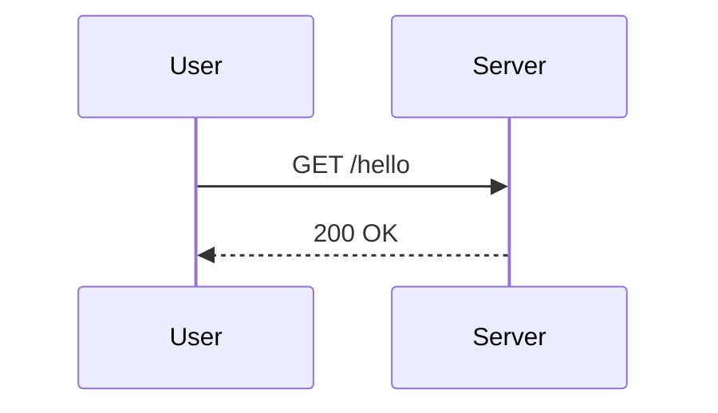

# Sequence Diagram（やり取りの流れ）
目的：主体同士のリクエスト／レスポンスを時系列で追跡し、責務の境界を把握できるようになる。

## 最小雛形

## よく使う
- ライフライン追加：`participant 名称 as 表示名`
- 同期／非同期：`->>` は同期、`-->>` はレスポンス
- ノート：`Note right of S: メモ` で補足を追加
- ループ：`loop 条件 ... end` で繰り返しを表現

## 演習
1. サーバから外部 API への呼び出しを `participant API` として追加し、レスポンスを受け取る流れを書こう。
2. ユーザーが 2 回同じリクエストを送るループを `loop` ブロックで包んでみよう。

## 注意
- アクター名は被らないようにし、実際の役割が伝わる表記を使う。
- 長い説明はノートに逃がして図を詰め込み過ぎない。
