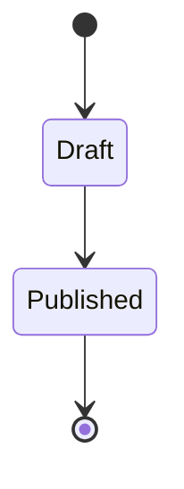

# 状態遷移図入門

## スタートコード
右上のエディタが空の場合は、以下をすべて貼り付けて保存してください。



シンプルな状態遷移図です。`[*]` は開始・終了を表し、矢印で状態間の遷移を表現します。

**記法のポイント**:
- `stateDiagram-v2`: 状態遷移図の宣言（v2を推奨）
- `[*]`: 開始状態または終了状態
- `状態1 --> 状態2`: 状態の遷移

---

### ハンズオン1: 遷移にラベルを付ける

`Draft --> Published` を `Draft --> Published: approve` に変更してください。

プレビューで矢印に「approve」というラベルが表示されます。`: ラベル` で遷移のトリガーや条件を示せます。

---

### ハンズオン2: 分岐を追加する

`Draft --> Published: approve` の次の行に `Draft --> Rejected: reject` を追加してください。

プレビューで `Draft` から2つの遷移が出ます。同じ状態から複数の遷移を作ることで、条件分岐を表現できます。

---

### ハンズオン3: 状態を増やして経路を複雑にする

`Published --> [*]` の前に以下の2行を追加してください：
```mermaid
  Rejected --> Draft: revise
  Rejected --> [*]
```

プレビューで `Rejected` から `Draft` への戻り経路と終了への経路が表示されます。複数の状態を組み合わせてワークフローを表現できます。

---

### ハンズオン4: 複合状態を追加する

最終行の前に以下を挿入してください：
```mermaid
  state Review {
    [*] --> Checking
    Checking --> Approved
    Checking --> ChangesRequested
  }
  Published --> Review: request_review
  Review --> [*]
```

プレビューで `Review` という複合状態（サブ状態を持つ状態）が表示されます。`state 名 { ... }` で内部に複数の状態を持つ複合状態を表現できます。

---

## 振り返り
- `[*]` は開始・終了の両方で使える
- `: ラベル` で遷移のトリガーや条件を表現できる
- 同じ状態から複数の矢印を出して分岐を表現できる
- `state 名 { ... }` で複合状態（階層構造）を作れる
