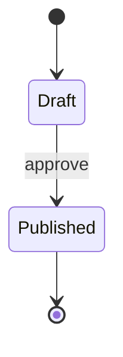
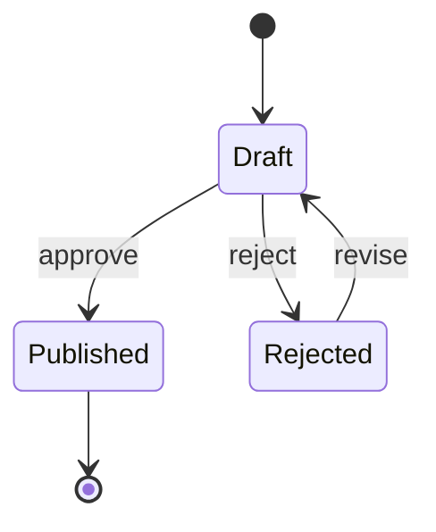
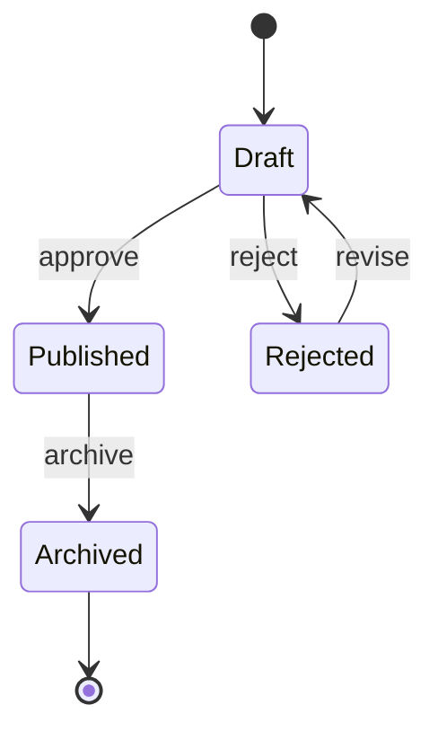
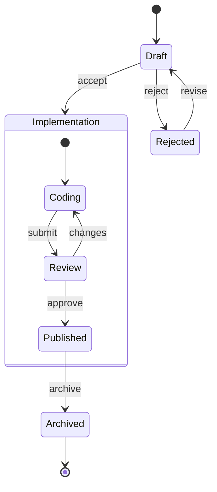

# 状態遷移図入門

## 目的
- 状態図で初期状態・終端状態・遷移ラベルを手入力で理解する。
- 指示どおりに `playground.mmd` を編集し、遷移経路がどう変わるか確認する。

## スタートコード
以下を `playground.mmd` に貼り付けて保存してください。

---

### ハンズオン1: 否認フローを追加する
1. 上記コード全体を次の内容に置き換えてください。`Rejected` 状態を追加しています。

2. 「reject」「revise」の遷移が追加されていることを確認しましょう。

---

### ハンズオン2: 公開後のアーカイブを追加する
1. 次のコードに置き換えてください。`Archived` 状態を終端にしました。

2. プレビューで `Archived` が終端に向かうことを確認してください。

---

### ハンズオン3: 実装中のサブ状態を作る
1. 最後に以下へ置き換えてください。`state Implementation { ... }` を追加しています。

2. サブ状態 `Implementation` 内の遷移が表示されることを確認しましょう。

---

## 振り返り
- `[*]` は初期／終端の両方で利用できる。
- 状態名の直後に `: ラベル` を書くと遷移のトリガーが可視化される。
- `state 名 { ... }` で複合状態を作成し、内部のフローを段階的に表現できる。
