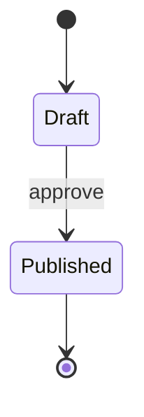

# State Diagram（状態遷移）
目的：状態と遷移条件を整理し、ワークフローの抜け漏れを防げるようになる。

## 最小雛形

## よく使う
- 初期／終了：`[*]` を開始・終了に使用
- 遷移ラベル：`StateA --> StateB: trigger`
- コンポジット状態：`state Parent { ... }`
- 選択：`state if ...` を使って分岐を表現

## 演習
1. `Draft` から `Rejected` へ遷移する `reject` アクションを追加し、`Rejected` から再び `Draft` に戻せるようにしよう。
2. 公開後に `Archived` 状態へ移行する遷移を追加し、終了状態を `Archived --> [*]` に変更してみよう。

## 注意
- すべての状態から終了へ到達できるか確認する。
- ループが多い場合は説明ノートを添えて読み手を迷わせない。
