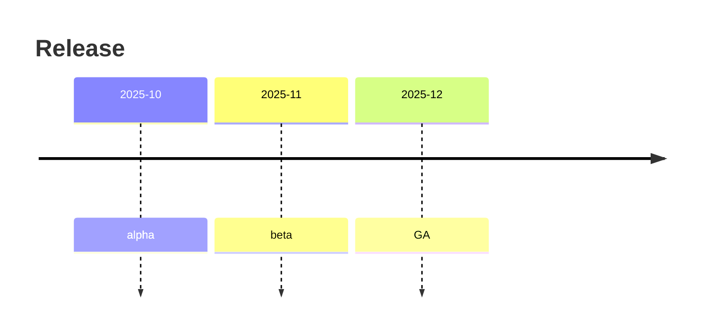

# Timeline（時系列の整理）
目的：出来事やマイルストーンを時系列で俯瞰し、長期計画の共有に役立てる。

## 最小雛形

## よく使う
- 行の構文：`YYYY-MM : 説明`
- タイトル：`title` を先頭に置いて文脈を伝える
- 範囲：`Period : 2025-10, 2026-03` のように期間指定も可能
- コメント：`note` キーワードで補足を追加

## 演習
1. `GA` の後に `2026-01 : retrospective` を追加し、振り返りを図に入れよう。
2. `alpha` と `beta` の間に `2025-10 : beta prep` を挿入して並び替えを確認する。

## 注意
- 同じ月が複数ある場合は表示順に注意。上の行ほど先に描画される。
- 日付フォーマットは `YYYY-MM-DD` も可だが統一すること。
