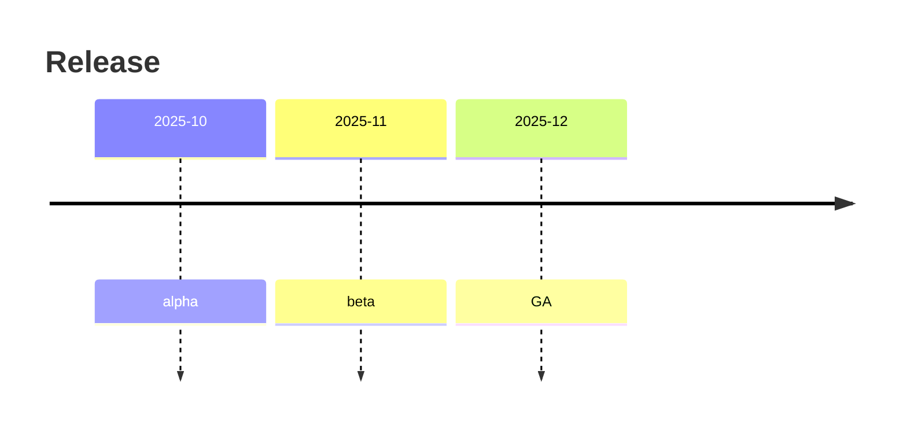
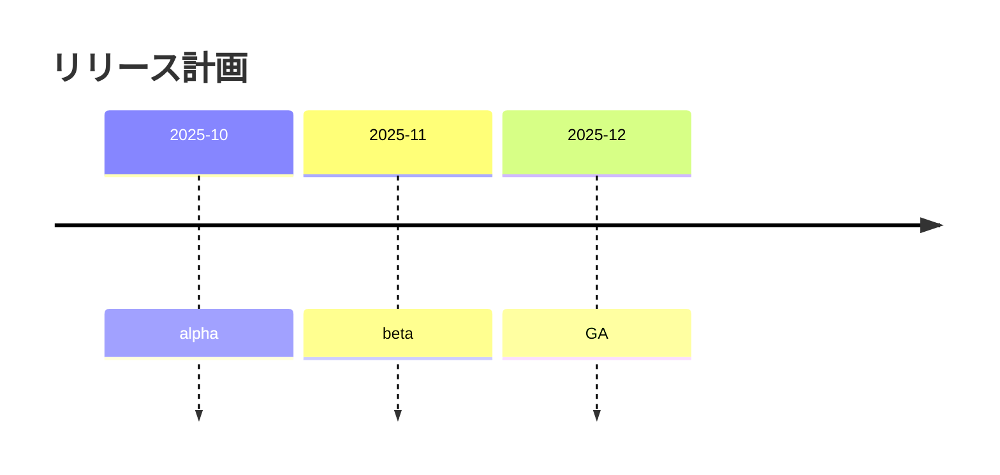
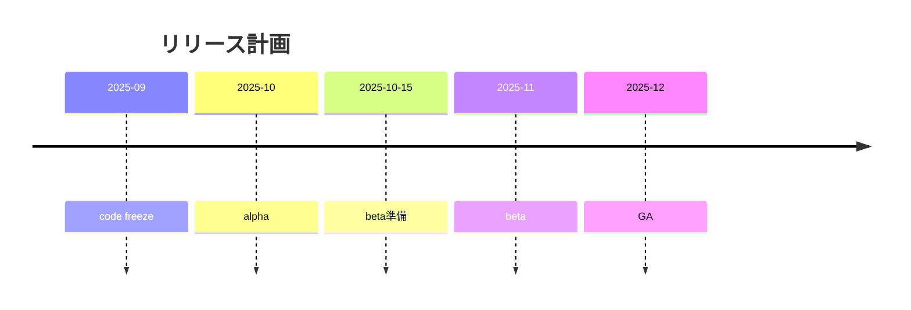
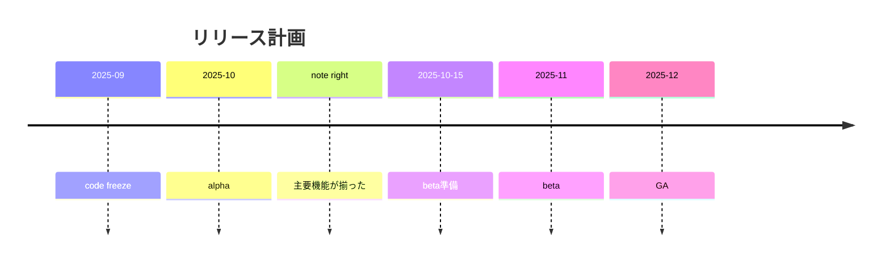

# タイムライン入門

## 目的
- 日付順の出来事を手入力で作成し、行の挿入・並び替えを体験する。
- 指示どおりに `playground.mmd` を編集して、タイムラインの変化を確認する。

## スタートコード
以下を `playground.mmd` に貼り付けて保存してください。

---

### ハンズオン1: 日本語タイトルにする
1. コードを次の内容に差し替え、タイトルを変更します。

2. プレビューでタイトルが日本語になることを確認してください。

---

### ハンズオン2: 出来事を増やす
1. 上記コードを以下へ置き換え、beta の前後に項目を追加します。

2. 挿入した行が時系列順に並ぶことを確認しましょう。

---

### ハンズオン3: 過去イベントのメモを追加する
1. 最後に以下のコードへ置き換え、ノートを追加します。

2. `alpha` の行に吹き出しが表示されることを確認してください。

---

## 振り返り
- 行頭の年月は自動で昇順にソートされる。
- 行のインデントを1段下げて `note right:` などを書けばメモを添えられる。
- タイムラインはシンプルなので、出来事の追加・削除で変化をすぐ確認できる。
