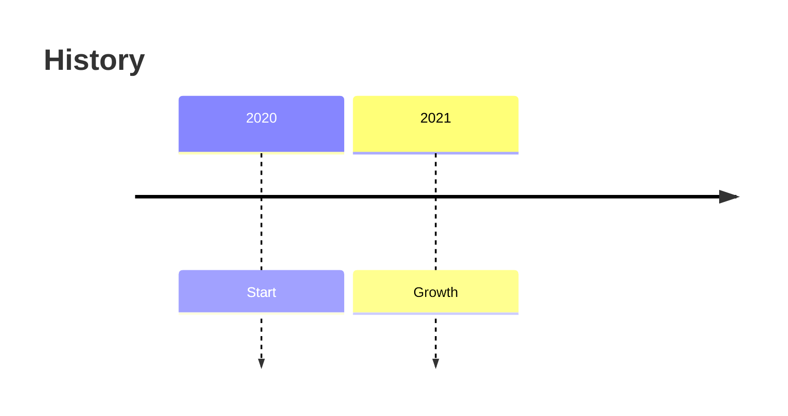

# タイムライン入門

## スタートコード
右上のエディタが空の場合は、以下をすべて貼り付けて保存してください。

シンプルなタイムラインです。時系列で出来事を視覚化します。

**記法のポイント**:
- `timeline`: タイムラインの宣言
- `title タイトル`: タイムラインのタイトル
- `期間 : イベント`: 出来事の定義

---

### ハンズオン1: イベントを追加する

最終行の後に `2022 : Success` を追加してください。

プレビューで新しいイベントが時系列に追加されます。年代順に自動的に配置されます。

---

### ハンズオン2: 同じ年に複数のイベントを追加する

2行目を `2020 : Start : Launch` に変更してください。

プレビューで2020年に2つのイベントが表示されます。コロン `:` で区切ることで同じ期間に複数のイベントを記載できます。

---

### ハンズオン3: より詳細な期間を指定する

最終行の後に `2022-06 : Mid-year review` を追加してください。

プレビューで月単位の期間が表示されます。年だけでなく年月（YYYY-MM）や年月日（YYYY-MM-DD）も指定できます。

---

### ハンズオン4: タイトルを変更する

1行目を `timeline title プロジェクト史` に変更してください。

プレビューでタイトルが日本語になります。タイトルは日本語でも英語でも使用できます。

---

## 振り返り
- `title タイトル` でタイムラインのタイトルを設定
- `期間 : イベント` の形式で出来事を定義
- 同じ期間に複数のイベントは `:` で区切る
- 期間は年、年月、年月日など柔軟に指定できる
